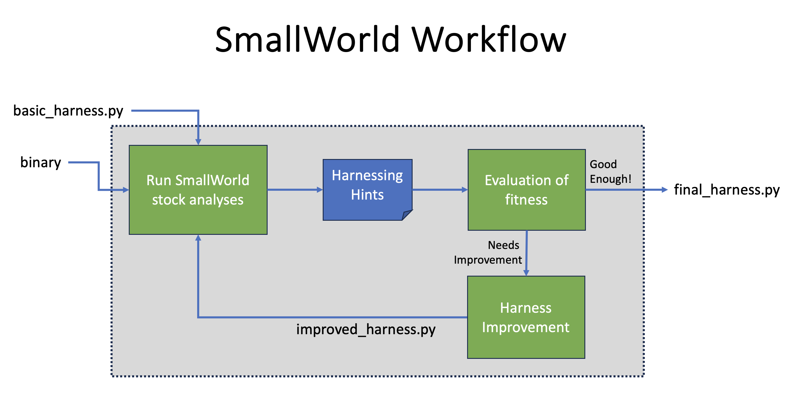

SmallWorld at a Glance
----------------------

SmallWorld is an environment for streamlined harnessing of binaries for the
purpose of dynamic analysis. We imagine that you have code that you got from
somewhere. You may want to analyze it statically, with Ghidra or IDA Pro. But,
at some point, you are likely to want to actually *run* the code and even do so
under some kind of analysis that tracks or collects information
programmatically. For example, you may want to do some coverage-guided fuzzing.
Or run a PANDA taint analysis. A prerequisite for running code is *harnessing*
the code, meaning arranging for its various inputs and initial conditions and
dynamic requirements to be met.

SmallWorld includes a suite of APIs to facilitate harnessing. Additionally,
SmallWorld has analyses tailored to guiding the creation of harnesses, e.g.,
which emulate code under inspection to determine what its "inputs" are and how
they are used by the code, indicating type and semantics.

SmallWorld is written in Python, and currently makes use of `Unicorn
<https://www.unicorn-engine.org/>`_, `Capstone
<https://www.capstone-engine.org/>`_, and `angr <https://angr.io/>`_. Unicorn
is used to emulate various instruction set architectures.  More specifically,
however, SmallWorld uses Unicorn for *micro-execution*, an analytic technique
in which short stretches of code are run under possibly random initial
conditions to determine inputs and outputs, structure layouts, etc. Capstone
provides disassembly support, and angr is used to provide a variety of
harnessing-guiding hints.

The basic workflow for SmallWorld is as follows

1. Start with a stock harnessing script that assumes little or nothing about 
   the code and its requirements to run.
2. Run stock SmallWorld analyses against the code using current harness to
   generate *hints* explaining what is wrong or incomplete about the way it runs
   given the harness. 
3. Examine hints either manually or with higher level analyses and use that as
   a guide refining the harnessing script.
4. Iterate until the harness is stable and/or some other fitness criterion is
   met.

   
Now that you have a harness for the code, you can use it to for any purpose
that requires actually executing the code, which could be fuzzing, debugging,
or reverse engineering.  As SmallWorld matures, we will add examples of these
applications built out of code harnessed using the APIs and informed by the
analyses in this repository.
